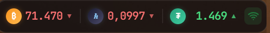

# CryptoWidget

Lightweight Windows desktop widget that shows real-time crypto prices with a transparent, always-on-top UI.

## What It Does

- Displays live prices for:
  - `BTC / USD` (Binance)
  - `HBAR / USD` (Binance)
  - `USDT / ARS` (DolarAPI)
- Refreshes data every 30 seconds.
- Shows trend direction (up/down/flat).
- Uses visual health states (OK / warning / error) based on request failures.
- Runs as an Electron app with system tray controls.
- Builds Windows installer (`NSIS`) and portable package via `electron-builder`.

## Tech Stack

- Node.js
- Electron
- electron-builder
- Plain HTML/CSS/JS renderer

## Requirements

- Windows 10/11
- Node.js 18+ (LTS recommended)
- npm (comes with Node.js)

## Quick Start (Windows)

1. Open PowerShell in the project folder.
2. Install dependencies:

```powershell
npm install
```

3. Start the app in development mode:

```powershell
npm start
```

## Build for Distribution

### 1) Build Windows installer (`.exe`)

```powershell
npm run build
```

Expected output (inside `dist/`):
- `CryptoWidget Setup <version>.exe`

### 2) Build portable executable

```powershell
npm run build-portable
```

Expected output (inside `dist/`):
- `CryptoWidget <version>.exe` (portable)

## Project Structure

```text
crypto-widget/
  assets/               # Tray/app icons and static assets
  src/
    index.html          # Widget UI + renderer logic
    main.js             # Electron main process (window/tray/lifecycle)
    preload.js          # Context bridge
    fullscreen_check.cs # Windows fullscreen state helper source
  package.json
  README.md
```

## Runtime Behavior

- Single instance lock: prevents multiple app instances.
- Frameless transparent window anchored to the top-right corner.
- Tray click toggles visibility.
- App keeps running in tray when window closes.
- Periodic fullscreen detection hides widget while fullscreen apps are active.

## Data Sources

- Binance API v3 ticker endpoint:
  - `BTCUSDT`
  - `HBARUSDT`
- DolarAPI:
  - `/v1/dolares/cripto`

## Troubleshooting

- `npm start` fails:
  - Delete `node_modules` and `package-lock.json`, then run `npm install` again.
- Build fails with Windows permissions:
  - Run terminal as Administrator.
- Tray icon missing:
  - Verify icon files exist in `assets/`.
- Fullscreen auto-hide not working:
  - Confirm the fullscreen helper binary is present when packaged (`src/fullscreen_check.exe` unpacked by Electron Builder settings).

## License

No license file is currently included.
